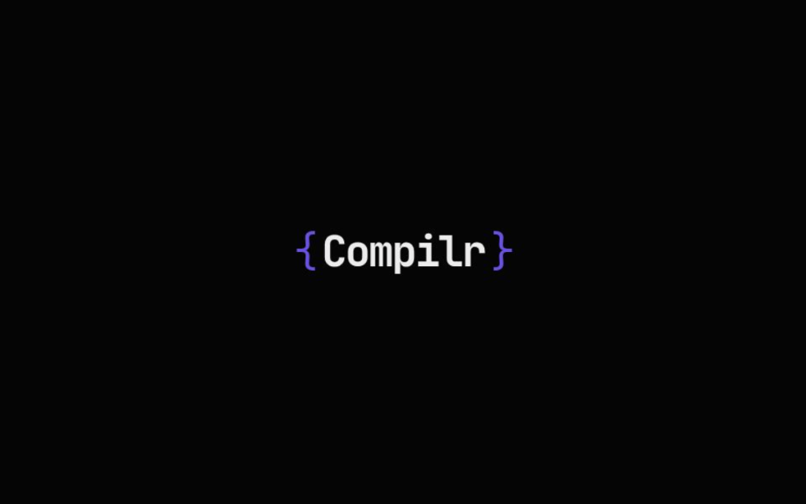

# Compilr { }

**Visualize code execution. Understand the machine.**

Compilr is an interactive tool I built to visualize how compilers work under the hood. It breaks down code into tokens, builds an Abstract Syntax Tree (AST), and simulates execution steps in real-time.

It currently supports **C++**, **Java**, and **JavaScript**.



## What it does

1.  **Lexical Analysis**: Breaks your code into individual tokens.
2.  **Syntax Analysis**: visualizing the AST (Abstract Syntax Tree) using a dynamic graph.
3.  **Execution**: Simulates the step-by-step logic your code follows.

## Tech Stack

- **Next.js 15** (App Router)
- **React Flow** for the graph visualization.
- **Turbopack** for fast builds.
- **CSS Modules** for clean, scoped styling.

## Running Locally

1.  Clone the repo:

    ```bash
    git clone https://github.com/sahilmane69/compilr.git
    cd compilr
    ```

2.  Install dependencies:

    ```bash
    npm install
    ```

3.  Run the dev server:
    ```bash
    npm run dev
    ```

## License

MIT © Sahil Mane
